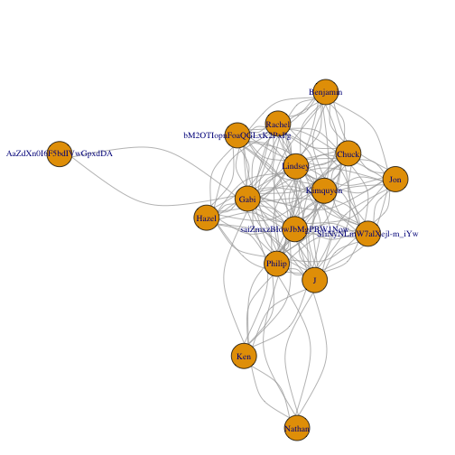

# Title
The purpose of this project is to come up with some interesting questions around the online review data available from the Yelp Data Set Challenge (http://www.yelp.com/dataset_challenge) and try to find them a plausible answer.

# Introduction
I will address the following questions:

1. Which kind of reviews (positive or negative) impact more business attendance (check-in) by category (limited to restaurants and shopping).

2. Investigate which attributes impact more on business attendance (check-in) by category (limited to restaurants and shopping). 

3. Find the most reliable users based on their number of reviews, duration as yelp user, number of tips, number of compliments, number of fans and number of friends. Derive the rules that characterize this group so any "yelper" may apply these rules to decide which reviews might be more valuable.

I think that the answers to these questions can be both interesting to business owners as well as to Yelp users.

In order to keep brief this report, I will only show the most relevant results. Details of the whole process I followed can be found on github:

* https://github.com/nebursm/Data-Science-Capstone 

# Methods and Data

## Data preparation
After reading the data, I loaded it into MongoDB since it directly supports JSON format. The
script for loading the data can be found in the following file **mongoscript.txt**. Then I
used the community edition of Mongo Management Studio (http://www.litixsoft.de) to browse
through the data.

Then I transformed the JSON data into a relational format because I believe SQL is a more powerful language for exploratory analysis than MongoDB query capabilities. The R script for doing the transformation can be found in the following file **Capstone_data_preparation.R**.

After this, I loaded the data in a MySQL database. The procedure for loading the data and the
DDL to create the tables can be found in the following file **yelp_01.sql**. In file **yelp_02.sql** you can find some sample queries. Finally a picture of the data model showing the
relationship between the tables can be found in **yelp_datamodel.pdf**.

Based on this exploratory analysis I formulated the research questions and imagine some possible outcomes for each of them.

## Which reviews have more impact on business attendance

Contrary to my expectations it seems that there is no significant relationship between variables *stars* and *checkin_tot*. As you can see in the following lines, the correlation of these two variables is almost zero. 

I also tried to build a prediction model using trees for these two variables but the result
I got once again showed me that there is no meaningful relationship regardless of the number
of stars the business has. 

The complete R script is in the file **Capstone_Question01.R**.


```r
# Read business data
business <- read.csv("data/business.csv", stringsAsFactors = FALSE)
# Split the data in 2 subsets: one with low average rates (2 stars or less) and the 
# other with high rating (4 stars or more)
bus_low <- subset(business, stars <= 2.0, select = c(checkin_tot, stars))
bus_high <- subset(business, stars >= 4.0, select = c(checkin_tot, stars))

# Discard outliers (business with more than 500 checkins)
bus_sub <- subset(business, checkin_tot <= 500, select = c(checkin_tot, stars))
boxplot(bus_sub$checkin_tot ~ bus_sub$stars, xlab = "Stars", ylab = "Check-in", varwidth = TRUE, col = "red3", main="Distribution of total checkins accross rate (stars)")
```

 

```r
# Explore correlation between ratings and checkin
cor_tab <- data.frame(low=cor(bus_low$checkin_tot, bus_low$stars), high=cor(bus_high$checkin_tot, bus_high$stars))
cor_tab
```

```
##         low       high
## 1 0.1161453 -0.1131387
```

```r
# Train a model using trees
fit_low <- train(stars ~ ., data=bus_low, method="rpart")
```

```
## Warning in nominalTrainWorkflow(x = x, y = y, wts = weights, info =
## trainInfo, : There were missing values in resampled performance measures.
```

```r
fit_high <- train(stars ~ ., data=bus_high, method="rpart")
```

```
## Warning in nominalTrainWorkflow(x = x, y = y, wts = weights, info =
## trainInfo, : There were missing values in resampled performance measures.
```

```r
# Print the resulting trees
library(rattle)
par(mfrow = c(1,2))
fancyRpartPlot(fit_low$finalModel)
fancyRpartPlot(fit_high$finalModel)
```

 

## Investigate which attributes have more impact on business attendance


The complete R script for this question is in file **Capstone_Question02.R**.

The general procedure was:

1. Read business data. The result is a data frame with 22,075 observations and 124 variables.
2. Replace all logical variables with dummy variables.
3. Remove all unnecessary columns.
4. Remove confounding variables (tip_count and review_count) because they are highly correlated with the predictor variable checkin_tot).
5. Discretize the predictor variable *checkin_tot*.
6. Create 2 subsets, restaurant data and shopping data.
7. Remove other attributes with high correlation in each subset.
8. Create training and testing data for each subset.
9. Train a random forest model for each training subset.
10. Calculate the model accuracy for each category (restaurant, shopping).
11. Print the 10 most important variables for each category.
12. Generate new models using only the top 10 variables to compare with original models.

The following code partially illustrates steps 10 to 12 of the procedure.


```r
# Calculate model accuracy for each category:
pred_rest <- predict(rest_trn_rf, newdata=test_rest)
```

```
## Error in eval(expr, envir, enclos): objeto 'By_Appointment_Only' no encontrado
```

```r
pred_shop <- predict(shop_trn_rf, newdata=test_shop)
```

```
## Error in eval(expr, envir, enclos): objeto 'By_Appointment_Only' no encontrado
```

```r
# Calculate model accuracy for each category and compare with previous model:
pred_rest2 <- predict(rest_trn_rf2, newdata=test_rest)
pred_shop2 <- predict(shop_trn_rf2, newdata=test_shop)
rest_cm2 <- confusionMatrix(pred_rest2, test_rest$checkin_tot_disc)
print("Restaurant comparision")
```

```
## [1] "Restaurant comparision"
```

```r
print(paste("Accuracy prev ==>",rest_cm$overall[1],"  Accuracy new ==>",rest_cm2$overall[1]))
```

```
## [1] "Accuracy prev ==> 0.716576279179439   Accuracy new ==> 0.659750058948361"
```

```r
shop_cm2 <- confusionMatrix(pred_shop2, test_shop$checkin_tot_disc)
print("Shopping comparision")
```

```
## [1] "Shopping comparision"
```

```r
print(paste("Accuracy prev ==>",shop_cm$overall[1],"  Accuracy new ==>",shop_cm2$overall[1]))
```

```
## [1] "Accuracy prev ==> 0.689655172413793   Accuracy new ==> 0.612068965517241"
```

## Find the most reliable users 


The complete R script for this question is in file **Capstone_Question03.R**.

To find the most reliable users I used two different approaches. First I used an unsupervised clustering algorithm to split user data into groups. To find the number of clusters I used the within sum of squares which measure the euclidean distance among the different members of each group for different number of clusters. 


```r
set.seed(12345)
samp <- sample(nrow(user_scale), size=1000)
user_scale_samp <- user_scale[samp, ]
kclusts <- data.frame(k=1:9) %>% group_by(k) %>% do(kclust=kmeans(user_scale_samp, .$k))
clusters <- kclusts %>% group_by(k) %>% do(tidy(.$kclust[[1]]))
assignments <- kclusts %>% group_by(k) %>% do(augment(.$kclust[[1]], user_scale_samp))
clusterings <- kclusts %>% group_by(k) %>% do(glance(.$kclust[[1]]))
ggplot(assignments, aes(review_count, tot_compliments)) + geom_point(aes(color=.cluster)) + facet_wrap(~ k)
```

 

```r
ggplot(clusterings, aes(k, tot.withinss)) + geom_line()
```

 

From here we can conclude that k=4 is a reasonable number of clusters. More clusters add little value according to the total within the sum of squares. Also, a visual examination of the distinct number of clusters confirms this. 

Using k-means I created 4 groups of users with the following characteristics:


```r
# get cluster means 
aggregate(user_sub,by=list(fit$cluster),FUN=mean)
```

```
##   Group.1 review_count       fans average_stars       funny      useful
## 1       1    838.82687 128.638806      3.816896  3527.76716  5112.20000
## 2       2   1602.19298 467.105263      3.832281 13242.85965 17645.64912
## 3       3     35.76066   1.214618      3.025897    19.33646    48.68826
## 4       4    371.77483  23.339781      3.780788   461.62385   867.17523
## 5       5     35.31426   1.462605      4.238075    16.69747    45.60521
##          cool tot_compliments user_friends tip_count fit.cluster user_id
## 1  4092.27463     4682.286567   503.050746 21.525373           1      NA
## 2 15104.94737    15592.561404  1075.859649 24.192982           2      NA
## 3    16.97402        9.836206     9.463203  4.429551           3      NA
## 4   543.62615      448.203522   121.970266 26.076501           4      NA
## 5    20.54235       12.793885    12.862065  4.985261           5      NA
```

So group 2 is the one with the users with more reviews, fans, friends, etc.

Now, in the second approach I used network analysis algorithms. For this, Using the friends data, I built a network with 2,576,179 nodes and 174,100 edges and performed 2 analysis:

* Betweenness centrality: It is equal to the number of shortest paths from all vertices to all others that pass through that node. A node with high betweenness centrality has a large influence on the transfer of items through the network, under the assumption that item transfer follows the shortest paths. (https://en.wikipedia.org/wiki/Betweenness_centrality)
* Page Rank: The PageRank algorithm outputs a probability distribution used to represent the likelihood that a person randomly clicking on links will arrive at any particular page. (https://en.wikipedia.org/wiki/PageRank)

I obtained the top 20 users according to each criterion and then created a new subset from the intersection of both sets of users.

We can see the results in the following graph:


```r
# Plot the resulting network
par(mai=c(0,0,1,0)) 
plot(top_net, layout=layout.fruchterman.reingold, vertex.label.cex=0.8)
```

 

Finally, we intersect this subset with the subset from cluster 2 to find the most influential users.

```r
# Search common user_id from cluster and network analysis:
intersect(unames[,2],user_sub_cl2$user_id)
```

```
## [1] "fczQCSmaWF78toLEmb0Zsw" "J3rNWRLRuZJ_0xsJalIhlA"
## [3] "kGgAARL2UmvCcTRfiscjug"
```

# Results

### Which reviews have more impact on business attendance
We have to further investigate if ratings influence Yelp users decision to attend a particular
business. Based on the results I obtained, it seems that ratings have little to do with business 
attendance.

### Investigate which attributes have more impact on business attendance
From the model accuracy, we can conclude that random forest generates a reasonable predicting model for business check-in. Accuracy for restaurants was 0.72 and for shopping 0.69. These models were built with 69 variables for restaurants and 41 variables for shopping. If we build the models using only the 10 most influential variables we loose some accuracy, but we have simpler models. Accuracy drops from 0.72 to 0.66 in the restaurant model, and from 0.69 to 0.61 in the shopping model.

The most important variables for restaurants are:

```r
rest_imp <- varImp(rest_trn_rf)
plot(rest_imp, top = 10)
```

 

The most important variables for shopping are:

```r
shop_imp <- varImp(shop_trn_rf)
plot(shop_imp, top = 10)
```

 

### Find the most reliable users 
Using clustering I was able to find a small group of 57 users which seems to be the most reliable because of their high participation in Yelp. Among other characteristics this group has the following numbers (the figures were obtain using the mean value of each attribute for cluster 2):


```r
(aggregate(user_sub,by=list(fit$cluster),FUN=mean))[2,]
```

```
##   Group.1 review_count     fans average_stars    funny   useful     cool
## 2       2     1602.193 467.1053      3.832281 13242.86 17645.65 15104.95
##   tot_compliments user_friends tip_count fit.cluster user_id
## 2        15592.56      1075.86  24.19298           2      NA
```

From the network analysis I obtained a group of 16 users which are the most influential according to betweenness centrality and page rank:


```r
V(user_net)[top_both]
```

```
## + 16/174100 vertices, named:
##  [1] 4ozupHULqGyO42s3zNUzOQ AaZdXn0I6F5bdIVwGpxdDA bM2OTIopnFoaQGLxK2PxPg
##  [4] cRyNICH0mhjxagvSyVr60Q CvMVd31cnTfzMUsHDXm4zQ fczQCSmaWF78toLEmb0Zsw
##  [7] J3rNWRLRuZJ_0xsJalIhlA kGgAARL2UmvCcTRfiscjug nEYPahVwXGD2Pjvgkm7QqQ
## [10] nKoB5cWZHXYUIUcQsUDogA pKh4Pc96YbOg-6hBOOajAA saiZmxzBIowJbMgPBW1Now
## [13] SfiNyNLmW7alXejl-m_iYw UKq38-9aOgEbJojosyS8gQ WKR1O8p216GT0YDQ7EjwCg
## [16] WmAyExqSWoiYZ5XEqpk_Uw
```

Finally, there are 3 users which are in both groups: cluster 2 and the 16 users from network analysis:


```r
intersect(unames[,2],user_sub_cl2$user_id)
```

```
## [1] "fczQCSmaWF78toLEmb0Zsw" "J3rNWRLRuZJ_0xsJalIhlA"
## [3] "kGgAARL2UmvCcTRfiscjug"
```

# Discussion

From the results obtained for each of my questions, the most surprising result was that review ratings are not correlated to business attendance. I was trying to find if a negative review has more impact than a positive review or vice versa. There is one thing that could lead to further research. The correlation between low ratings (less or equal to 2 stars) and total check-ins is 0.12 while the correlation between high ratings (great or equal to 4 stars) and total check-ins is -0.11. Even though both values are close to zero one is positive and the other negative. Maybe by extending the analysis to include the review text we may find something more interesting.  

The results for the other 2 questions are very interesting and useful for 2 different groups. 

Remember that question 2 investigates the most significant attributes related to restaurant and shopping attendance. These results may help business increase their sales by adding some of the mose relevant features found (for example, wi-fi in restaurants or parking valet in shopping centers).   

In question 3 I tried to find the most reliable users using 2 approaches. The first one builds a cluster of the users with more participation in Yelp and derive the group characteristics. I found that Yelp users can obtain a reliable review when it comes from those who meet the group characteristics (those having on average 1,600 reviews, 400 fans, 1,000 friends, 15,000 compliments, etc). Very important is that fake reviews will be more evident since they don't get as many compliments as real ones. 

With the second approach, I used network analysis to get a list of the top influential users according to their friends network. Once again, the reviews from these users could be the first a Yelp user might check with confidence. 

Finally, all the results need to be periodically updated with new data from Yelp to keep the models current and valid.


